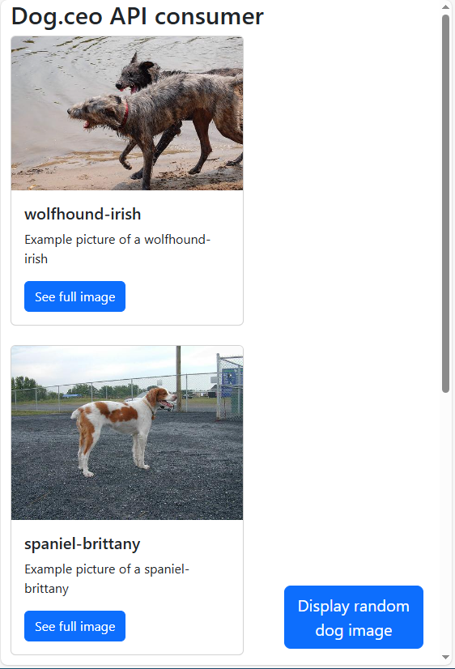

# Project Overview
This project is an exploration of web API consumption, specifically utilizing the API provided by [Dog CEO's Dog API](https://dog.ceo/dog-api/). The primary technologies employed are JavaScript and TypeScript, offering a practical application for enhancing skills in interacting with web APIs.

## Local Development Instructions
To get started with local development, follow these steps:

1. **Clone the Repository**: Clone the repository to your local machine to start development.
2. **Compile TypeScript**: Use the command `tsc --watch` to compile TypeScript. The `watch` argument ensures that TypeScript recompiles upon detecting any changes in the code.
3. **Run the Website Locally**: Utilize the `Live Server` extension in Visual Studio Code to run the website locally and view changes in real-time.

## Live Website
The live version of the website can be accessed at [https://joeprogrammer88.github.io/DogAPIExample/](https://joeprogrammer88.github.io/DogAPIExample/).

## Visual Representation
Below is a screenshot demonstrating the functionality of the project:

